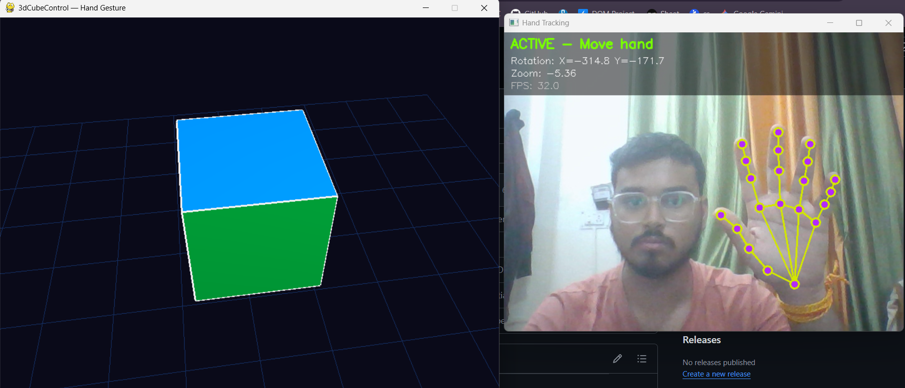

<div align="center">

# 🖐️ 3dCubeControl — Hand Gesture 3D Control

### Control a 3D Cube in Real-Time using only your Hand

[](https://python.org)
[](https://opencv.org)
[](https://mediapipe.dev)
[](https://pygame.org)
[](http://pyopengl.sourceforge.net)
[](LICENSE)

</div>

---

## 📸 Preview

### Live Demo Screenshot


> *Left: 3D cube with neon cyberpunk theme rendered in OpenGL | Right: Real-time hand tracking with MediaPipe — 21 landmark detection, neon cyan skeleton, pink joint dots*

---

### 🎬 Live Demo Video

https://github.com/mohitr2111/3dCubeControl/raw/main/ScreenShot/2.mp4

> *Full demo — rotating, zooming and controlling the 3D cube using bare hand gestures at 32 FPS*

---

## 🌟 What is 3dCubeControl?

**3dCubeControl** is a real-time interactive application that lets you **manipulate a 3D cube using nothing but your hand**. No controller, no mouse, no touch — just your hand in front of a webcam.

Built on top of **Google's MediaPipe Tasks API** for hand landmark detection and **OpenGL** for 3D rendering, the system detects 21 precise hand landmarks per frame and translates your hand movements into smooth 3D transformations — rotation on X and Y axes and zoom — all at real-time speed.

The UI features a **dark neon / cyberpunk theme** — deep navy background, vivid neon-colored cube faces, bright white edges, and a neon skeleton hand overlay.

---

## ✨ Features

| Feature | Description |
|---------|-------------|
| 🖐️ **21-Point Hand Tracking** | Full hand skeleton with MediaPipe Tasks API |
| 🎲 **Real-Time 3D Rendering** | OpenGL-powered cube with Phong lighting |
| 🌀 **Multi-Axis Rotation** | Rotate on X and Y axes simultaneously |
| 🔍 **Pinch-to-Zoom** | Smooth zoom with pinch gesture |
| 💤 **Idle Auto-Rotation** | Cube slowly rotates when no hand detected |
| 🎨 **Neon Cyberpunk Theme** | Dark navy bg, vivid neon cube faces, white edges |
| 📊 **Live HUD Overlay** | Real-time FPS, Rotation X/Y, Zoom on screen |
| ⚡ **Smooth Gesture Filtering** | Moving average + exponential smoothing |
| 🔄 **Auto Model Download** | MediaPipe model auto-downloads on first run |
| ⌨️ **Keyboard Shortcuts** | Reset, Quit via keyboard |

---

## 🎮 Controls

### ✋ Hand Gestures

| Gesture | Action |
|---------|--------|
| 🖐️ Open hand + move **Left / Right** | Rotate cube on **Y-axis** |
| 🖐️ Open hand + move **Up / Down** | Rotate cube on **X-axis** |
| 🤏 **Pinch** (Thumb + Index closer) | **Zoom In** |
| 🤏 **Pinch** (Thumb + Index apart) | **Zoom Out** |
| ✊ Close hand / Remove hand | **Pause** — cube enters idle rotation |

### ⌨️ Keyboard

| Key | Action |
|-----|--------|
| `R` | Reset cube to default position |
| `Q` or `ESC` | Quit application |

---

## 🏗️ Project Structure

```
3dCubeControl/
│
├── main.py                  # Main application (all logic)
├── requirements.txt         # Python dependencies
├── README.md                # This file
├── LICENSE                  # MIT License
├── .gitignore               # Git ignore rules
│
├── ScreenShot/
│   ├── 1.png                # Live demo screenshot
│   └── 2.mp4                # Live demo screen recording
│
└── hand_landmarker.task     # MediaPipe model (auto-downloaded, gitignored)
```

---

## ⚙️ How It Works

```
Webcam Frame
     │
     ▼
┌─────────────────────┐
│   OpenCV Capture    │  640×480, flipped (mirror)
└────────┬────────────┘
         │
         ▼
┌─────────────────────┐
│  MediaPipe Tasks    │  Detects 21 hand landmarks per frame
│  HandLandmarker     │  VIDEO mode @ ~30fps
└────────┬────────────┘
         │
         ▼
┌─────────────────────┐
│  GestureController  │  Palm center → rotation delta
│                     │  Pinch distance → zoom delta
│                     │  Exponential smoothing applied
└────────┬────────────┘
         │
         ▼
┌─────────────────────┐
│   OpenGL Renderer   │  800×600 window
│   (Pygame + OpenGL) │  Phong lighting (2 lights)
│                     │  6-face colored cube + grid
└─────────────────────┘
```

---

## 🎨 UI Theme — Dark Neon / Cyberpunk

| Element | Color / Style |
|---------|--------------|
| 🌌 Background | Deep dark navy `(0.04, 0.04, 0.10)` |
| 🟥 Cube Front | Neon Red `(1.0, 0.08, 0.08)` |
| 🟩 Cube Back | Neon Green `(0.0, 1.0, 0.3)` |
| 🟦 Cube Top | Electric Blue `(0.0, 0.5, 1.0)` |
| 🟨 Cube Bottom | Neon Yellow `(1.0, 0.95, 0.0)` |
| 🟪 Cube Right | Neon Purple `(0.8, 0.0, 1.0)` |
| 🩵 Cube Left | Neon Cyan `(0.0, 1.0, 0.9)` |
| ⬜ Cube Edges | Bright White — 2.5px |
| 🔷 Grid | Dark Neon Blue |
| 🫀 Hand Skeleton | Neon Cyan lines |
| 💜 Hand Joints | Neon Pink filled dots |

---

## 🔧 Technical Architecture

### Classes Overview

```
Config             →  All tunable constants (resolution, sensitivity, zoom limits)
HandTracker        →  MediaPipe Tasks API wrapper — detects landmarks, draws skeleton
GestureController  →  Converts landmark positions to rotation/zoom deltas with smoothing
Renderer3D         →  OpenGL cube + grid drawing, Pygame window management
App                →  Main loop — ties everything together, HUD overlay
```

### Key Config Parameters

```python
class Config:
    WEBCAM_WIDTH  = 640           # Webcam resolution
    WEBCAM_HEIGHT = 480
    RENDER_WIDTH  = 800           # 3D window size
    RENDER_HEIGHT = 600
    ROTATION_SENSITIVITY = 0.3    # Higher = faster rotation
    ZOOM_SENSITIVITY     = 0.015  # Higher = faster zoom
    smoothing_factor_size = 0.4   # Lower = more responsive, higher = smoother
    ZOOM_MIN = -15.0              # Max zoom out
    ZOOM_MAX = -2.0               # Max zoom in
    ZOOM_DEFAULT = -6.0           # Starting zoom level
```

### Smoothing Algorithm

The gesture controller uses a **two-stage smoothing pipeline**:

1. **Exponential Moving Average** — blends current delta with previous smooth value
```python
smooth_dx = alpha * delta[0] + (1 - alpha) * smooth_dx
```

2. **Moving Average Window** — averages last 5 frames for stability
```python
history_x = deque(maxlen=5)
rotation_y += mean(history_x) * ROTATION_SENSITIVITY
```

---

## 🚀 Setup & Installation

### Prerequisites

- Python **3.10+**
- Webcam (built-in or external)
- OS: Windows / macOS / Linux

### Step 1 — Clone the Repository

```bash
git clone https://github.com/mohitr2111/3dCubeControl.git
cd 3dCubeControl
```

### Step 2 — Create Virtual Environment

```bash
# Create
python3 -m venv venv

# Activate (macOS/Linux)
source venv/bin/activate

# Activate (Windows)
venv\Scripts\activate
```

### Step 3 — Install Dependencies

```bash
pip install -r requirements.txt
```

### Step 4 — Run

```bash
python3 main.py
```

> On **first run**, the MediaPipe hand landmarker model (~7.5 MB) downloads automatically.

```
[INFO] Starting 3D Cube Control... Press 'q' to quit.
Downloading hand landmark model...
Model downloaded!
Webcam opened successfully!
Hand tracker ready!
```

---

## 📦 Dependencies

```
opencv-python       # Webcam capture + image processing
mediapipe           # Hand landmark detection (Tasks API)
numpy               # Math operations for 3D transformations
pygame              # Window + event management
PyOpenGL            # 3D graphics rendering
PyOpenGL_accelerate # OpenGL speed boost (optional)
```

---

## 🛠️ Customization

### Change Rotation / Zoom Speed

```python
# In Config class
ROTATION_SENSITIVITY = 0.3    # Increase for faster rotation
ZOOM_SENSITIVITY = 0.015      # Increase for faster zoom
smoothing_factor_size = 0.4   # Lower = more snappy, higher = smoother
```

### Change Cube Colors

```python
# In draw_cube() — faces list
# Format: (normal, [R, G, B], vertices)
# R, G, B values are 0.0 to 1.0
([0, 0, 1],  [1.0, 0.08, 0.08], [...]),  # Front — change color here
([0, 0, -1], [0.0, 1.0,  0.3 ], [...]),  # Back
```

### Change Detection Confidence

```python
# In HandTracker.__init__()
options = vision.HandLandmarkerOptions(
    min_hand_detection_confidence=0.5,  # 0.0 to 1.0
    min_hand_presence_confidence=0.5,
    min_tracking_confidence=0.5,
)
```

---

## 🛟 Troubleshooting

### Camera Not Opening
- Ensure webcam is not used by another app
- **macOS**: System Preferences → Security & Privacy → Camera → enable Terminal/Python
- **Windows**: Settings → Privacy → Camera → enable

### Hand Not Detected
- Ensure good lighting — avoid very dark rooms
- Keep hand clearly visible, centered in frame
- Try reducing `min_hand_detection_confidence` to `0.3`

### Low FPS / Lag
- Close other applications
- Reduce `WEBCAM_WIDTH/HEIGHT` in Config
- Ensure GPU drivers are updated for OpenGL

### OpenGL Errors
- **Linux**: `sudo apt-get install python3-opengl`
- **Windows**: Update GPU drivers

### Module Not Found
- Ensure virtual environment is activated
- Re-run: `pip install -r requirements.txt`

---

## 📊 Performance

| Metric | Value |
|--------|-------|
| Typical FPS | **30–60 FPS** |
| Hand Landmarks | **21 points** per frame |
| Smoothing Window | **5 frames** moving average |
| Webcam Resolution | **640 × 480** |
| 3D Window | **800 × 600** |
| Model Size | **~7.5 MB** |

---

## 🔮 Future Enhancements

- [ ] Two-hand support — separate control per hand
- [ ] Multiple 3D shapes (sphere, pyramid, custom `.obj` models)
- [ ] Gesture recording and playback
- [ ] Color theme switcher via keyboard
- [ ] VR/AR mode integration
- [ ] Multi-object scene with hand collision

---

## 📜 License

This project is licensed under the **MIT License** — see the [LICENSE](LICENSE) file for details.

---

## 🙏 Acknowledgements

- [Google MediaPipe](https://developers.google.com/mediapipe) — Hand landmark detection
- [OpenCV](https://opencv.org) — Real-time computer vision
- [PyGame](https://www.pygame.org) — Window and event management
- [PyOpenGL](http://pyopengl.sourceforge.net) — OpenGL Python bindings

---

<div align="center">

**Control reality with your hands. 🖐️✨**

Made with ❤️ by [mohitr2111](https://github.com/mohitr2111)

</div>